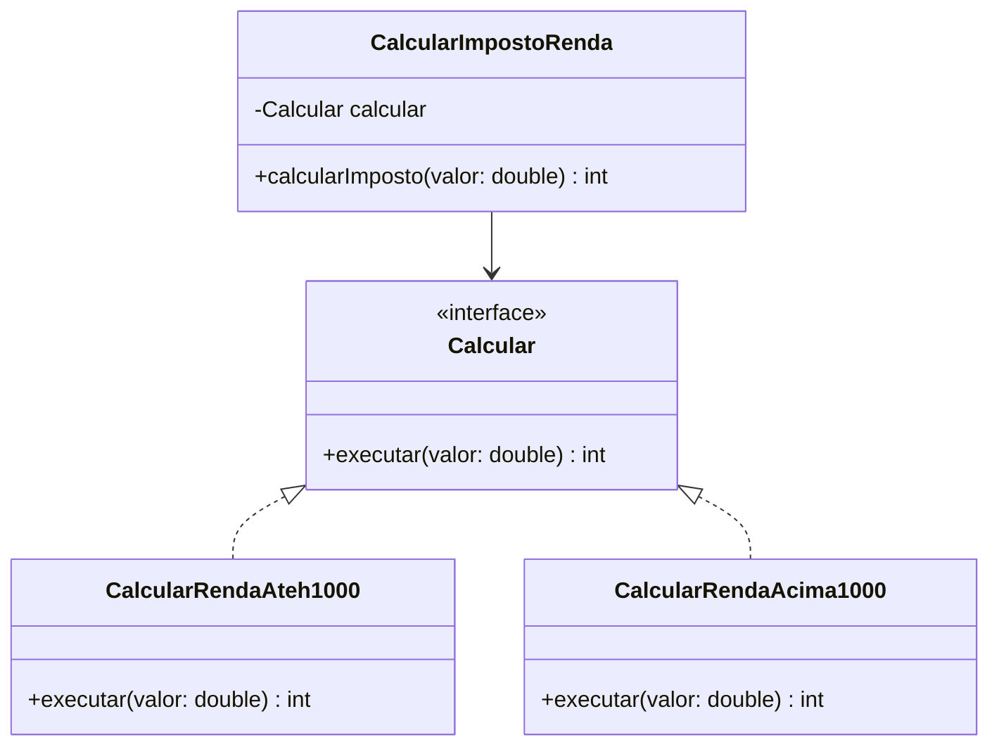
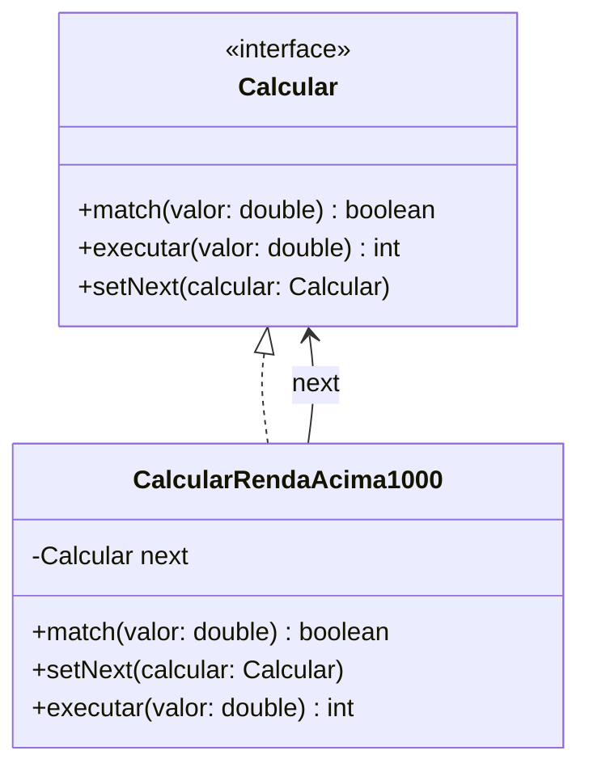

# Padrões de Projeto Comportamentais

## 📚 Introdução
Os padrões comportamentais lidam com a comunicação entre objetos, definindo como eles interagem e distribuem responsabilidades. Neste documento, focaremos em dois padrões importantes: Strategy e Chain of Responsibility.

## 🎯 Strategy Pattern

### Objetivo
O Strategy Pattern permite definir uma família de algoritmos, encapsular cada um deles e torná-los intercambiáveis. Permite que o algoritmo varie independentemente dos clientes que o utilizam.

### Quando Usar?
- Quando você tem variantes de um mesmo algoritmo
- Quando precisa isolar a lógica do algoritmo dos detalhes de implementação
- Quando há muitas condicionais relacionadas a variantes de um mesmo algoritmo

### Exemplo Prático: Cálculo de Imposto de Renda

#### ❌ Sem Strategy (Problema)
```javascript
class CalcularImpostoRenda {
   public int calcularImposto(valor: double) {
        if (valor < 1000) {
            return valor * 0.1; // 10%
        }
        if (valor > 1000 && valor < 3000) {
            return valor * 0.2; // 20%
        }
        return valor * 0.3; // 30%
   }
}
```

#### ✅ Com Strategy (Solução)
```javascript
interface Calcular {
   public int executar(valor: double);
}

class CalcularRendaAteh1000 implements Calcular {
   public int executar(valor: double) {
       return valor * 0.1; // 10%
   }
}

class CalcularRendaAcima1000 implements Calcular {
   public int executar(valor: double) {
       return valor * 0.2; // 20%
   }
}

class CalcularImpostoRenda {
    private Calcular calcular;

    public CalcularImpostoRenda(Calcular calcular) {
        this.calcular = calcular;
    }

    public int calcularImposto(valor: double) {
        return calcular.executar(valor);
    }
}
```

### 🏭 Implementação com Factory Pattern
```javascript
class FabricaImpostoRenda {
    public static CalcularImpostoRenda create(valor: double) {
        Calcular calcular = valor < 1000 
            ? new CalcularRendaAteh1000()
            : new CalcularRendaAcima1000();

        return new CalcularImpostoRenda(calcular);
    }
}

// Uso
CalcularImpostoRenda calculadora = FabricaImpostoRenda.create(valor);
int imposto = calculadora.calcularImposto(valor);
```

## ⛓️ Chain of Responsibility Pattern

### Objetivo
Permite que você passe solicitações ao longo de uma cadeia de handlers. Ao receber uma solicitação, cada handler decide processar a solicitação ou passá-la para o próximo handler na cadeia.

### Quando Usar?
- Quando mais de um objeto pode tratar uma solicitação e o handler não é conhecido a priori
- Quando você quer passar uma solicitação para um dentre vários objetos, sem especificar o receptor explicitamente
- Quando o conjunto de objetos que pode tratar uma solicitação deve ser especificado dinamicamente

### Exemplo Prático: Cálculo de Imposto com Cadeia

```javascript
interface Calcular {
   public boolean match(valor: double);
   public int executar(valor: double);
   public void setNext(Calcular calcular);
}

class CalcularRendaAcima1000 implements Calcular {
    private Calcular next = null;
   
    public boolean match(valor: double) {
        return valor > 1000;
    }

    public void setNext(Calcular calcular) {
        this.next = calcular;
    }   

    public int executar(valor: double) {
        if (this.match(valor)) {
            return valor * 0.2; // 20%
        }
        return this.next != null ? this.next.executar(valor) : 0;
    }
}

class FabricaCadeia {
    private static Calcular montarCadeia() {
        Calcular calculadoraBase = new CalcularRendaAteh1000();
        Calcular calculadoraMedia = new CalcularRendaAcima1000();
        
        calculadoraBase.setNext(calculadoraMedia);
        return calculadoraBase;
    }

    public static Calcular create() {
        return montarCadeia();
    }
}
```

### 🔄 Diagrama de Classes

#### Strategy Pattern


#### Chain of Responsibility Pattern


## 📝 Principais Diferenças

### Strategy
- Encapsula diferentes algoritmos para uma mesma tarefa
- Permite troca de algoritmos em tempo de execução
- Cada estratégia é independente das outras

### Chain of Responsibility
- Cria uma cadeia de objetos processadores
- Cada objeto decide se processa ou passa adiante
- Ordem de processamento é importante
- Permite adicionar ou remover responsabilidades dinamicamente

## 🎯 Benefícios

1. **Melhor Organização do Código**
   - Separação clara de responsabilidades
   - Código mais limpo e manutenível
   - Facilita testes unitários

2. **Flexibilidade**
   - Fácil adicionar novos comportamentos
   - Alterações localizadas
   - Redução de acoplamento

3. **Reutilização**
   - Comportamentos podem ser reutilizados
   - Menos duplicação de código
   - Maior modularidade

## ⚠️ Considerações
- Escolha o padrão adequado para cada situação
- Evite sobrecomplexidade em casos simples
- Mantenha a documentação atualizada
- Considere o impacto na performance
