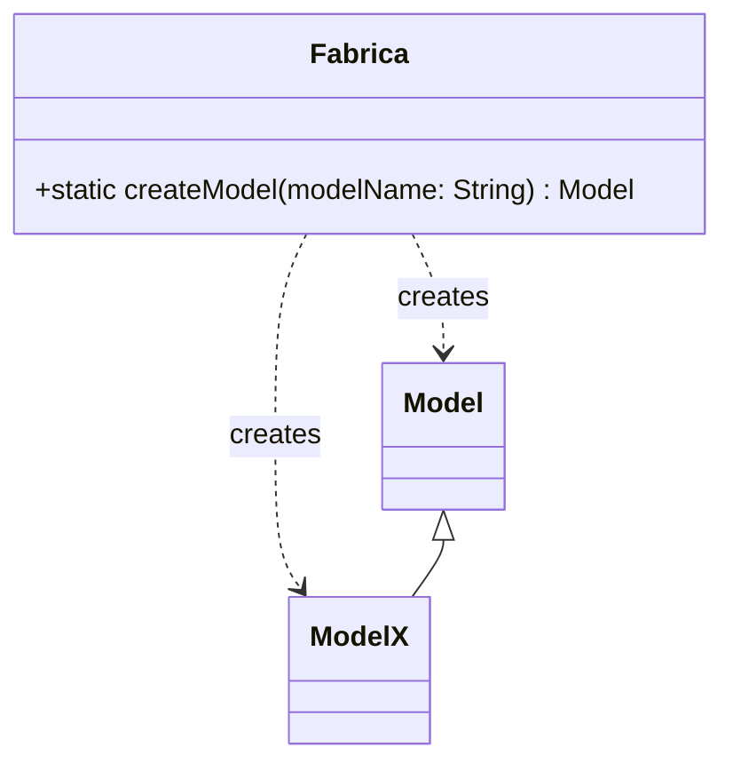
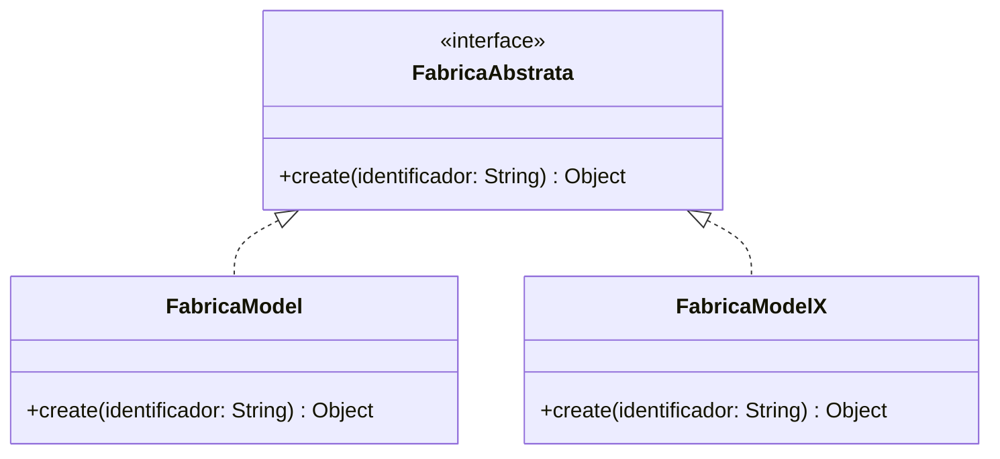

# Padrões de Projeto Criacionais

## 📚 Introdução
Os padrões criacionais são responsáveis por abstrair o processo de instanciação de objetos, tornando um sistema independente de como seus objetos são criados, compostos e representados.

## 🏭 Factory Method (Método Fábrica)

### Objetivo
Encapsular a lógica de criação de objetos em um método específico, permitindo que subclasses alterem o tipo de objetos que serão criados.

### Quando Usar?
- Para centralizar a lógica de criação de objetos
- Quando há necessidade de organizar instanciações
- Para desacoplar o código que cria do código que usa os objetos

### Exemplo Prático
```javascript
class Model {
    // Implementação base
}

class ModelX extends Model {
    // Implementação específica
}

class Fabrica {
    public static Model createModel(String modelName) {
        switch (modelName) {
            case "Model":
                return new Model();
            case "ModelX":
                return new ModelX();
            default:
                throw new IllegalArgumentException("Modelo desconhecido: " + modelName);
        }
    }
}

// Uso
Model model = Fabrica.createModel("Model");
ModelX modelX = (ModelX) Fabrica.createModel("ModelX");
```

## 🏭 Abstract Factory (Fábrica Abstrata)

### Objetivo
Fornecer uma interface para criar famílias de objetos relacionados sem especificar suas classes concretas.

### Quando Usar?
- Quando o sistema precisa ser independente de como seus produtos são criados
- Para criar famílias de objetos relacionados
- Quando você tem várias famílias de produtos

### Exemplo Prático
```javascript
interface FabricaAbstrata {
    public Object create(String identificador);
}

class FabricaModel implements FabricaAbstrata {
    public Object create(String identificador) {
        return new Model(identificador);
    }
}

class FabricaModelX implements FabricaAbstrata {
    public Object create(String identificador) {
        return new ModelX(identificador);
    }
}

// Uso
FabricaAbstrata fabricaModel = new FabricaModel();
Model model = (Model) fabricaModel.create("basic");
```

## 🏗️ Builder

### Objetivo
Separar a construção de um objeto complexo da sua representação, permitindo criar diferentes representações usando o mesmo processo de construção.

### Quando Usar?
- Para construir objetos complexos passo a passo
- Quando o objeto precisa ser construído em uma sequência específica
- Quando o processo de construção deve permitir diferentes representações do objeto

### Exemplo Prático
```javascript
class BuilderEndereco {
    private Usuario usuario;
    private String rua;
    private String cidade;

    public BuilderEndereco comUsuario(String nomeUsuario) {
        this.usuario = new Usuario(nomeUsuario);
        return this;
    }

    public BuilderEndereco comRua(String rua) {
        this.rua = rua;
        return this;
    }

    public BuilderEndereco comCidade(String cidade) {
        this.cidade = cidade;
        return this;
    }

    public Endereco build() {
        return new Endereco(usuario, rua, cidade);
    }
}

// Uso
Endereco endereco = new BuilderEndereco()
    .comUsuario("João")
    .comRua("Rua Principal")
    .comCidade("São Paulo")
    .build();
```

## 🔒 Singleton

### Objetivo
Garantir que uma classe tenha apenas uma instância e fornecer um ponto global de acesso a ela.

### Quando Usar?
- Para controlar acesso a recursos compartilhados
- Quando precisar exatamente de uma instância para coordenar ações no sistema
- Para substituir variáveis globais

### Exemplo Prático
```javascript
class ControleRequisicao {
    private static ControleRequisicao instance;
    private int numeroRequisicoes;

    private ControleRequisicao() {
        numeroRequisicoes = 0;
    }

    public static ControleRequisicao getInstance() {
        if (instance == null) {
            instance = new ControleRequisicao();
        }
        return instance;
    }

    public void registrarRequisicao() {
        numeroRequisicoes++;
    }
}

// Uso
ControleRequisicao controle = ControleRequisicao.getInstance();
```

## 🔄 Prototype

### Objetivo
Especificar os tipos de objetos a serem criados usando uma instância protótipo e criar novos objetos copiando este protótipo.

### Quando Usar?
- Quando a criação de um objeto é custosa ou complexa
- Para criar cópias de objetos mantendo o desempenho
- Quando as classes a instanciar são especificadas em tempo de execução

### Exemplo Prático
```javascript
interface Prototype<T> {
    T clone();
}

class Model implements Prototype<Model> {
    private String nome;
    private Map<String, Object> propriedades;

    public Model clone() {
        Model clone = new Model();
        clone.setNome(this.nome);
        clone.setPropriedades(new HashMap<>(this.propriedades));
        return clone;
    }
}

// Uso
Model prototype = new Model();
prototype.setNome("ModeloBase");
Model clone1 = prototype.clone();
clone1.setNome("Clone1");
```

## 📊 Diagramas de Classe

### Factory Method


### Abstract Factory


## 🎯 Benefícios dos Padrões Criacionais

1. **Flexibilidade**
   - Desacoplamento entre criação e uso de objetos
   - Facilidade para trocar implementações
   - Código mais manutenível

2. **Reutilização**
   - Redução de duplicação de código
   - Centralização da lógica de criação
   - Maior consistência

3. **Manutenibilidade**
   - Código mais organizado
   - Separação clara de responsabilidades
   - Facilidade para testes

## ⚠️ Considerações

1. **Escolha do Padrão**
   - Analise a complexidade necessária
   - Considere o impacto na manutenção
   - Avalie a necessidade real do padrão

2. **Implementação**
   - Mantenha a simplicidade
   - Documente as decisões de design
   - Siga as convenções de nomenclatura

3. **Performance**
   - Considere o overhead de criação
   - Avalie o impacto na memória
   - Balance flexibilidade e desempenho
