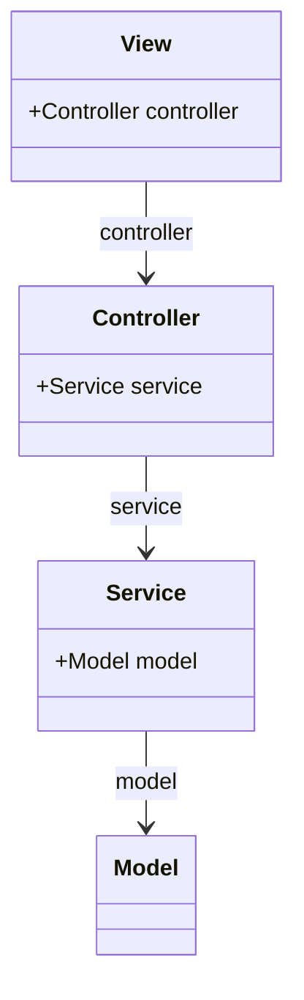
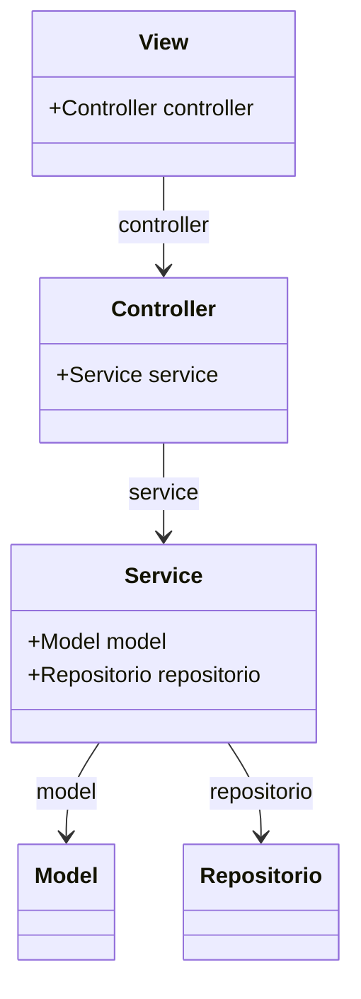
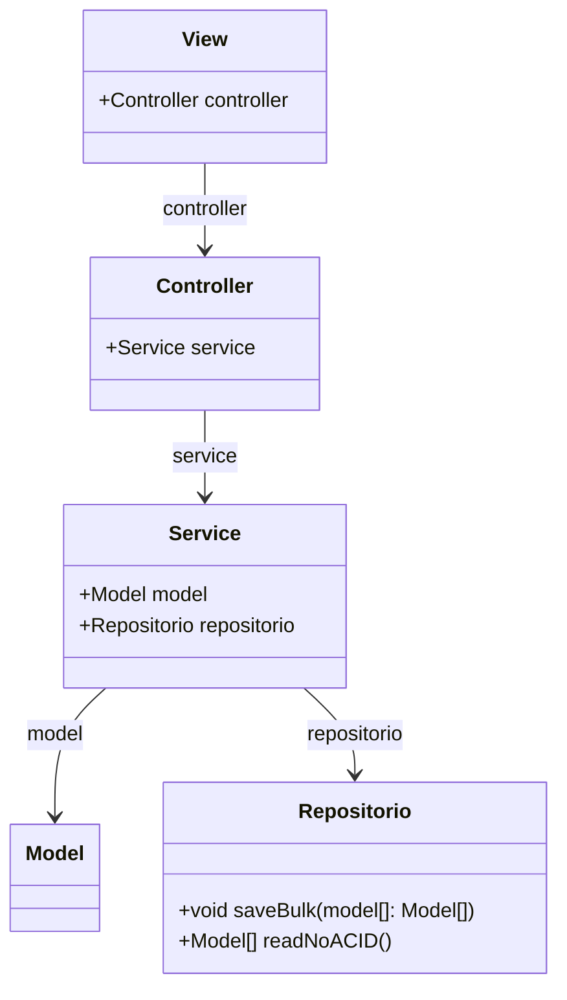

# Como Estruturar o Pensamento para resolver um problema programando

## Eu sei que tipo de problema e solução eu vou criar?
## Resposta: Não

[Extreme Go Horse!](https://gohorse.com.br/extreme-go-horse-xgh/) (Se pensar, não é Extreme Go Horse!!)
## Resposta: Sim, Qual padrão estrutural eu posso Usar?
     
### Desenvolvimento com interação com usuário (sem performance): Model-View-Controller (Aplicações simples)
```javascript
        // Responsavel por conversar com o usário
        class View  (){
            controller: Controller    
        }
        // Responsavel por conversar relacionar a View com as Regras de Negócio (Model)
        class Controller(){
            service: Service
        }
        // IMplementa os casos de uso
        class Service (){
            model: Model
        }
        // Estrutura de dados
        class Model (){

        }
```
### Modelo



### Desenvolvimento com interação com usuário (sem performance e com persistencia de dados): Model-View-Controller (Aplicações simples)

```js
        // Responsavel por conversar com o usário
        class View  (){
            controller: Controller    
        }
        // Responsavel por conversar relacionar a View com as Regras de Negócio (Model)
        class Controller(){
            service: Service
        }
        // IMplementa os casos de uso
        class Service (){
            model: Model
            repositorio: Repositorio
        }
        // Estrutura de dados
        class Model (){

        }
        // Responsavel pela persistencia dos dados
        class Repositorio (){

        }
```
### Model



### Desenvolvimento com interação com usuário (com performance e com persistencia de dados): Model-View-Controller (Aplicações simples)

* O que eu devo performar? 
    * Escrita: Padrão Bulk (inserir mais de 1 elemento por vez no local de persistência), por exemplo
    * Consulta: Cache, salvar os dados conforme a minha query, ou mudar a arquitura para algo mais performatico (e.g, CQRS)

* E quais opções eu tenho antes de mudar a arquitetura?

* Qual o custo?

```js
        // Responsavel por conversar com o usário
        class View  (){
            controller: Controller    
        }
        // Responsavel por conversar relacionar a View com as Regras de Negócio (Model)
        class Controller(){
            service: Service
        }
        // IMplementa os casos de uso
        class Service (){
            model: Model
            repositorio: Repositorio
        }
        // Estrutura de dados
        class Model (){

        }
        // Responsavel pela persistencia dos dados
        class Repositorio (){
              public void salveBulk(model[]: Model[])  
              public model[] readNoACID()
        }
```
## Modelo
