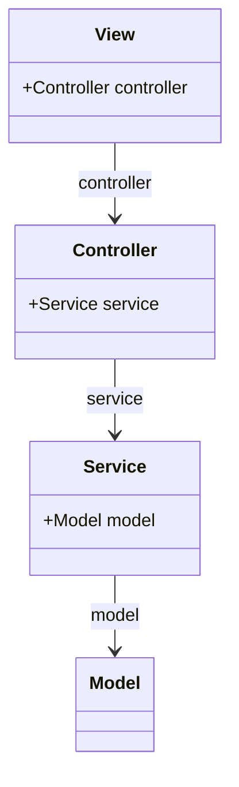
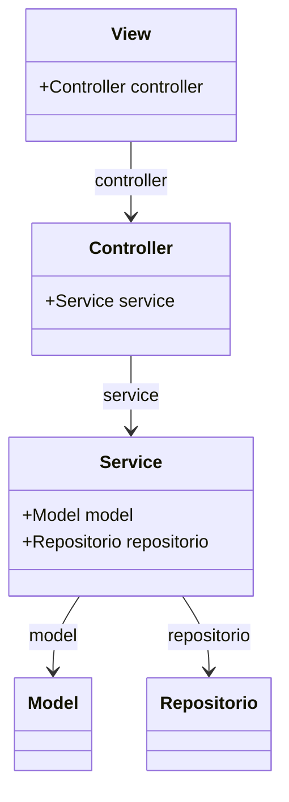
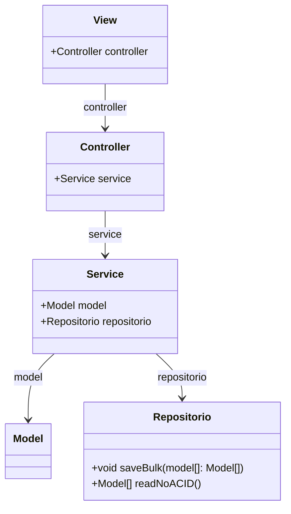
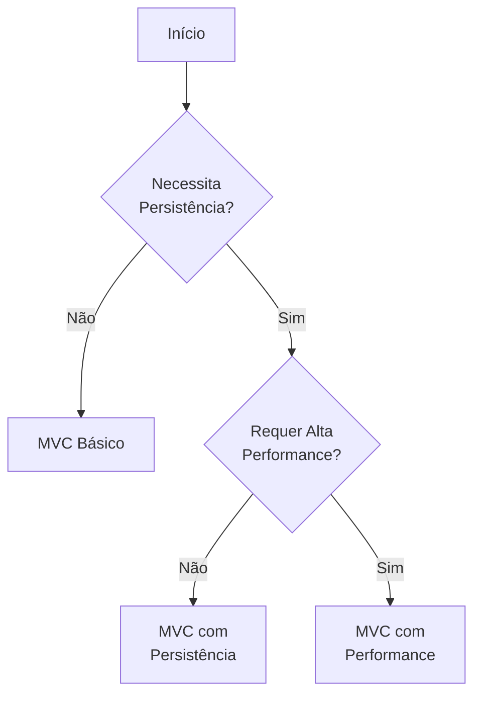

# Guia de Implementação MVC e suas Variações

## 🎯 Introdução

Antes de começar qualquer implementação, é crucial fazer a pergunta inicial:
**"Sei o tipo de problema e solução que vou criar?"**

- Se a resposta for **NÃO**: Evite a abordagem "Extreme Go Horse"
- Se a resposta for **SIM**: Continue com um dos padrões estruturais abaixo

## 1. 🌟 MVC Básico: Implementação Simples

Este padrão é ideal para aplicações com interação de usuário sem requisitos específicos de performance.

### Estrutura de Classes
```javascript
// Interface com usuário - Responsável pela apresentação
class View {
    controller: Controller    
}

// Coordena as ações entre View e Model
class Controller {
    service: Service
}

// Implementa a lógica de negócio
class Service {
    model: Model
}

// Define a estrutura de dados
class Model {
    // Propriedades e métodos do modelo
}
```

### Diagrama de Classes


### Características Principais
- Separação clara de responsabilidades
- Fluxo unidirecional de dependências
- Facilidade de manutenção
- Ideal para aplicações pequenas e médias

## 2. 💾 MVC com Persistência

Evolução do MVC básico para suportar armazenamento de dados.

### Estrutura de Classes
```javascript
// Interface com usuário
class View {
    controller: Controller    
}

// Coordenador de ações
class Controller {
    service: Service
}

// Lógica de negócio com persistência
class Service {
    model: Model
    repositorio: Repositorio
}

// Estrutura de dados
class Model {
    // Propriedades e métodos
}

// Gerenciamento de persistência
class Repositorio {
    // Métodos de acesso a dados
}
```

### Diagrama de Classes


### Características Principais
- Adição da camada de persistência
- Separação entre lógica de negócio e acesso a dados
- Maior flexibilidade no armazenamento
- Suporte a diferentes fontes de dados

## 3. ⚡ MVC com Performance

Versão otimizada para alto desempenho.

### Considerações de Performance
1. **Otimização de Escrita**
   - Implementação de operações em lote (Bulk)
   - Redução de operações I/O

2. **Otimização de Leitura**
   - Implementação de cache
   - Queries otimizadas
   - Possível uso de CQRS

### Estrutura de Classes
```javascript
class View {
    controller: Controller    
}

class Controller {
    service: Service
}

class Service {
    model: Model
    repositorio: Repositorio
}

class Model {
    // Propriedades otimizadas
}

class Repositorio {
    // Métodos otimizados para performance
    public void salveBulk(model[]: Model[])  
    public model[] readNoACID()
}
```

### Diagrama de Classes


### Características Principais
- Operações em lote para escrita
- Leituras não-ACID para maior performance
- Cache estratégico
- Otimizações específicas por caso de uso

## 🔄 Fluxo de Decisão para Escolha do Padrão



## 📝 Considerações de Implementação

### Para MVC Básico
- Mantenha a separação de responsabilidades
- Evite lógica de negócio na View
- Use o Controller como coordenador

### Para MVC com Persistência
- Isole operações de banco de dados
- Implemente tratamento de erros
- Considere transações quando necessário

### Para MVC com Performance
- Monitore pontos de gargalo
- Implemente métricas
- Avalie trade-offs de consistência
- Documente otimizações

## ⚠️ Pontos de Atenção

1. **Escolha do Padrão**
   - Complexidade do projeto
   - Requisitos de performance
   - Necessidades de manutenção

2. **Implementação**
   - Mantenha a coesão
   - Evite acoplamento
   - Documente decisões importantes

3. **Manutenção**
   - Monitore performance
   - Atualize documentação
   - Revise periodicamente
